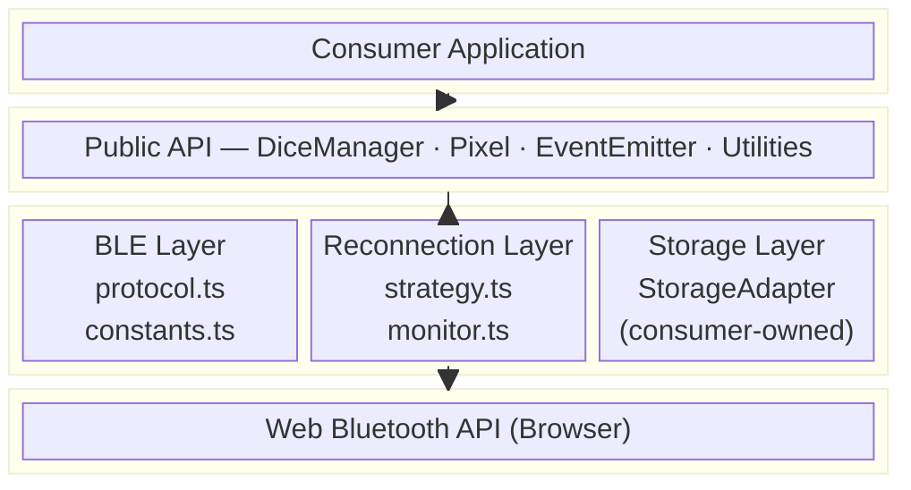
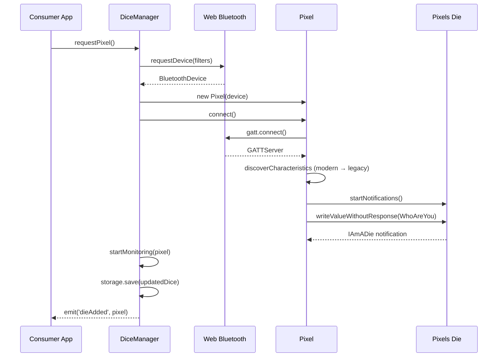
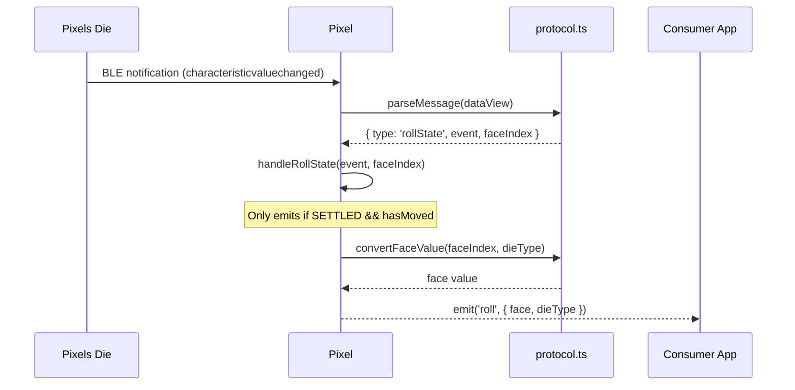
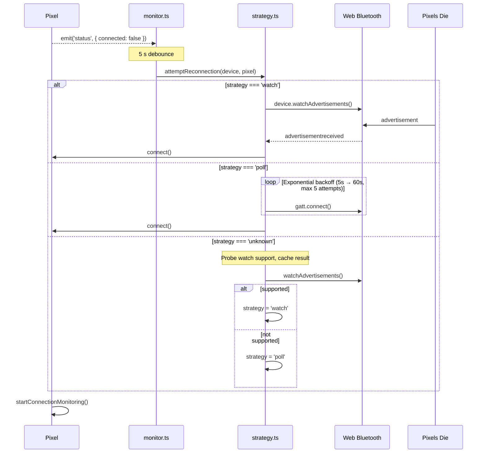

# Architecture

This document describes the high-level architecture of `@scooper4711/pixels-ble`, a TypeScript library for communicating with Pixels electronic dice over Bluetooth Low Energy.

## System Overview

## Module Responsibilities

### `src/index.ts` — Public Surface

The barrel export. Every symbol that consumers can import is re-exported from here. Internal implementation details remain private.

### `src/Pixel.ts` — Single Die Controller

Owns the lifecycle of one Bluetooth device:

1. **Connection** — Negotiates GATT, discovers characteristics (modern + legacy UUIDs), subscribes to notifications.
2. **Protocol handling** — Routes incoming BLE notifications through the protocol parser and emits typed events (`roll`, `status`, `battery`).
3. **Commands** — Serializes outgoing messages (WhoAreYou, Blink, RequestBatteryLevel) and writes them to the write characteristic.
4. **Connection monitoring** — Periodic health check (30 s interval) with integrated battery polling (every 5 minutes).

### `src/DiceManager.ts` — Multi-Die Orchestrator

High-level coordinator for applications that manage multiple dice:

- **Pairing** — Wraps `navigator.bluetooth.requestDevice` with correct filters for Pixels service UUIDs.
- **Reconnection** — Calls `watchAdvertisements` on known devices and triggers GATT reconnection on advertisement receipt.
- **Persistence** — Delegates storage to a consumer-provided `StorageAdapter`, keeping the library agnostic to the persistence backend.
- **Event forwarding** — Aggregates per-die events into manager-level events (`dieAdded`, `dieConnected`, etc.).

### `src/EventEmitter.ts` — Typed Event Bus

A lightweight generic event emitter parameterized by an event map interface. Provides `addEventListener`, `removeEventListener`, and a protected `emit`. Used as the base class for both `Pixel` and `DiceManager`.

### `src/ble/constants.ts` — Protocol Constants

All BLE UUIDs (modern and legacy), message type identifiers, die type face-count lookup table, and roll event constants. Single source of truth for the wire protocol.

### `src/ble/protocol.ts` — Message Parsing and Serialization

Stateless functions that convert between raw `DataView` buffers and typed TypeScript structures:

- **Parsing**: `parseMessage` dispatches on the first byte (message type) and returns a discriminated union (`ParsedMessage`).
- **Face conversion**: `convertFaceValue` maps raw face indices to display values for each die type.
- **Serialization**: `serializeWhoAreYou`, `serializeBlink`, `serializeRequestBatteryLevel` produce `Uint8Array` command buffers.

### `src/reconnection/strategy.ts` — Adaptive Reconnection

Implements two strategies behind a unified interface:

| Strategy | Mechanism | When Used |
|----------|-----------|-----------|
| `watch` | `BluetoothDevice.watchAdvertisements` | Browser supports the API |
| `poll` | Exponential backoff GATT connect retries | Fallback when watch is unavailable or times out |

On first disconnect, the library probes for `watch` support. The detected strategy is cached for the session.

### `src/reconnection/monitor.ts` — Disconnect Detection

Listens for `status` events on each `Pixel`. When a disconnect is detected, it debounces (5 s) and delegates to `attemptReconnection`. Uses a `WeakMap` to track listeners per die without preventing garbage collection.

### `src/types.ts` — Shared Type Definitions

All public interfaces and type aliases: `PixelEvents`, `DiceManagerEvents`, `StorageAdapter`, `KnownDie`, `PixelInfo`, `DieType`.

## Data Flow

### Pairing a New Die

### Receiving a Roll

### Reconnection After Disconnect

## Build Architecture

The library is built with [tsup](https://tsup.egoist.dev/) into two formats:

| Output | Format | Target | Global Name |
|--------|--------|--------|-------------|
| `dist/esm/index.js` | ESM | ES2020 | — |
| `dist/umd/index.global.js` | IIFE | ES2020 | `PixelsBLE` |

TypeScript declarations are emitted separately via `tsc --emitDeclarationOnly` to `dist/types/`.

## Dependency Policy

The library has **zero production dependencies**. All functionality is implemented in terms of the Web Bluetooth API and standard JavaScript APIs. Dev dependencies are limited to the build toolchain (tsup, TypeScript) and test runner (vitest).
